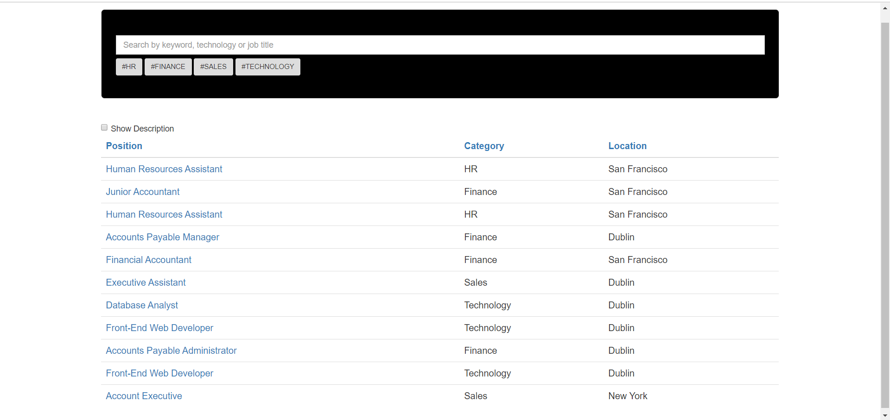

# AngularJs Job Listing Page

* Using API Endpoint to retrieve and display the jobs available (JSON format).
* Search box filters jobs on the title and description.text fields.
* Text Search only works when the user enters 2 or more characters.
* Clicking on Position,Category & Location sorts the data.
* Show Description checkbox allowing the user to display additional information on the jobs.
* Clicking each Position opens application form.

## IDE & Libraries
* Bootstrap 3
* AngularJS 1.5.7
* Atom IDE & atom-live-server (plugin)

